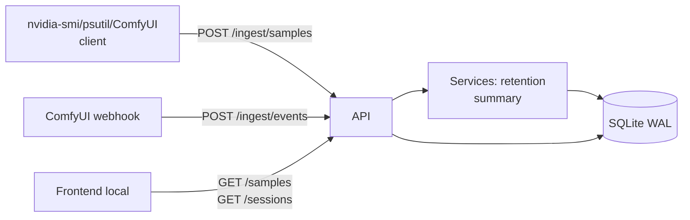
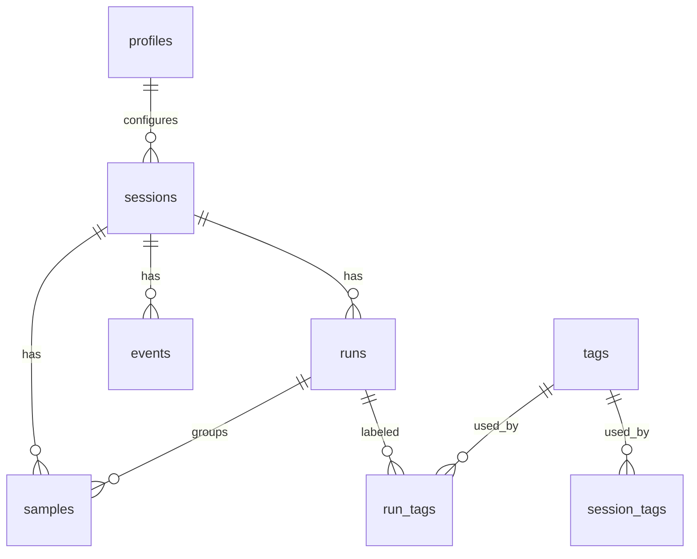

# DSD — Backend de Observabilidade de Gerações (ComfyUI) — MVP

**Versão:** 0.1.0\
**Data:** 2025-09-14\
**Autor:** Arquitetura Full‑Stack (Python/JS)\
**Status:** Em implementação (MVP)

---

## 1) Visão Geral

Backend local‑first para observabilidade de runs/gerações feitas com pipelines do ComfyUI. O serviço coleta e persiste amostras de métricas (GPU/CPU/RAM/processo), marca eventos (início/fim de sessão e run), agrega séries temporais para visualização, exporta dados e aplica políticas de retenção.

- **Stack:** FastAPI + Uvicorn | SQLAlchemy 2.0 | Alembic | SQLite (WAL) | Pydantic v2.
- **Execução:** local no PC do usuário (host loopback).
- **Consumidores:** Frontend local (HTML/JS/Tailwind), coletor (ex.: nvidia‑smi/psutil) e/ou webhook do ComfyUI.

> Este DSD detalha o **como** (design técnico) para implementar o MVP com SQLite embutido.

---

## 2) Escopo

**Incluído (MVP):**

- CRUD de **Sessões** e **Runs**, com estados e eventos.
- Ingestão de **amostras** (séries temporais) e **eventos** (marcos).
- Consulta com **downsample** (avg|min|max) e filtros por janela/metric/device.
- **Export** de sessão/run (CSV/Parquet zipado).
- **Retenção** por quantidade/duração com segmentação automática.
- **Perfis** (profiles) e **Preferências** globais (intervalos, métricas padrão, thresholds, política de retenção).
- **Health** do serviço e de sessão.

**Fora do MVP (Futuro):**

- Percentis exatos (p95/p99) no banco (usar aproximação em memória, ver §8.3).
- Autenticação com API‑Key/Token.
- Multi‑usuário, RBAC.
- Integração remota (cloud).

---

## 3) Contexto e Fluxos de Uso

1. Usuário inicia uma **sessão** de observabilidade (ativa única).
2. Coletor envia **amostras** periódicas (ex.: 1000 ms).
3. Quando um pipeline inicia/termina, envia **eventos** `run.start`/`run.end`.
4. UI consulta janelas com **downsample** para gráficos (5m/15m/60m).
5. Ao atingir limites de **retenção**, o backend segmenta/encerra sessão conforme política.
6. Usuário exporta **dados** para análise offline.

---

## 4) Arquitetura

### 4.1 Componentes

- **API HTTP (FastAPI):** roteadores: `sessions`, `runs`, `ingest`, `samples`, `export`, `profiles`, `preferences`, `health`.
- **Camada de Serviços:** regras de retenção, agregações, downsample.
- **Persistência (SQLite):** esquema relacional otimizado para leituras por janela temporal.

### 4.2 Diagrama de Alto Nível



### 4.3 Padrões e Convenções

- **Timestamps:** epoch **ms** (INTEGER). Conversão para ISO‑8601 na borda da API.
- **IDs:** `uuid4` (TEXT).
- **Serialização:** JSON (UTF‑8).
- **CORS:** restrito a `http://localhost`/`127.0.0.1`.

---

## 5) Modelo de Dados (SQLite)

### 5.1 Tabelas

- **sessions** (`id`, `name`, `status`, `started_at_ms`, `ended_at_ms`, `profile_id`, `note`, `created_at_ms`, `updated_at_ms`)

  - `status ∈ {inactive, active, paused, ended}`
  - **Regra:** apenas **1 ativa** (índice parcial)

- **runs** (`id`, `session_id*`, `status`, `start_ms`, `end_ms`, `duration_ms`, `note`)

  - `status ∈ {pending, running, concluded, failed, canceled, interrupted}`

- **samples** (`id` AUTOINC, `session_id*`, `run_id?`, `ts_ms*`, `metric_group*`, `metric_name*`, `value*` REAL, `device_index?` INT)

- **events** (`id` AUTOINC, `session_id*`, `ts_ms*`, `event_type*`, `run_id?`, `status?`, `meta_json?`)

- **tags**, **session\_tags**, **run\_tags** para rótulos.

- **profiles** (`id`, `name` UNIQUE, `description`, `prefs_json`)

- **preferences** (singleton `id=1`, `interval_ms_default`, `metrics_default_json`, `windows_default_json`, `thresholds_json`, `retention_policy_json`)

### 5.2 Restrições & Índices

- `ux_one_active_session` (parcial) em `sessions(status)` quando `status='active'`.
- Índices:
  - `samples(session_id, ts_ms)`
  - `samples(run_id, ts_ms)`
  - `samples(metric_group, metric_name)`
  - `runs(session_id, start_ms)`
  - `events(session_id, ts_ms)`

### 5.3 ERD



### 5.4 DDL Base (trechos)

```sql
PRAGMA journal_mode=WAL; PRAGMA synchronous=NORMAL; PRAGMA foreign_keys=ON;

CREATE TABLE IF NOT EXISTS sessions (
  id TEXT PRIMARY KEY,
  name TEXT NOT NULL,
  status TEXT NOT NULL CHECK (status IN ('inactive','active','paused','ended')),
  started_at_ms INTEGER,
  ended_at_ms INTEGER,
  profile_id TEXT,
  note TEXT,
  created_at_ms INTEGER NOT NULL,
  updated_at_ms INTEGER NOT NULL
);
CREATE UNIQUE INDEX IF NOT EXISTS ux_one_active_session
  ON sessions(status) WHERE status='active';

CREATE TABLE IF NOT EXISTS runs (
  id TEXT PRIMARY KEY,
  session_id TEXT NOT NULL,
  status TEXT NOT NULL CHECK (status IN ('pending','running','concluded','failed','canceled','interrupted')),
  start_ms INTEGER NOT NULL,
  end_ms INTEGER,
  duration_ms INTEGER,
  note TEXT,
  FOREIGN KEY(session_id) REFERENCES sessions(id)
);
CREATE INDEX IF NOT EXISTS ix_runs_session_time ON runs(session_id, start_ms);

CREATE TABLE IF NOT EXISTS samples (
  id INTEGER PRIMARY KEY AUTOINCREMENT,
  session_id TEXT NOT NULL,
  run_id TEXT,
  ts_ms INTEGER NOT NULL,
  metric_group TEXT NOT NULL,
  metric_name TEXT NOT NULL,
  value REAL NOT NULL,
  device_index INTEGER,
  FOREIGN KEY(session_id) REFERENCES sessions(id),
  FOREIGN KEY(run_id) REFERENCES runs(id)
);
CREATE INDEX IF NOT EXISTS ix_samples_session_ts ON samples(session_id, ts_ms);
CREATE INDEX IF NOT EXISTS ix_samples_run_ts ON samples(run_id, ts_ms);
CREATE INDEX IF NOT EXISTS ix_samples_mgroup_name ON samples(metric_group, metric_name);

CREATE TABLE IF NOT EXISTS events (
  id INTEGER PRIMARY KEY AUTOINCREMENT,
  session_id TEXT NOT NULL,
  ts_ms INTEGER NOT NULL,
  event_type TEXT NOT NULL,
  run_id TEXT,
  status TEXT,
  meta_json TEXT,
  FOREIGN KEY(session_id) REFERENCES sessions(id)
);
CREATE INDEX IF NOT EXISTS ix_events_session_ts ON events(session_id, ts_ms);
```

### 5.5 Política de Retenção (preferences.retention\_policy\_json)

```json
{
  "max_samples_per_session": 1000000,
  "max_duration_ms": 28800000,
  "on_limit": "segment"   // "segment" | "end"
}
```

- **segment:** encerra sessão e cria nova encadeada copiando tags/perfil.
- **end:** encerra sessão e rejeita novas ingestões (409).

---

## 6) API HTTP

### 6.1 Convenções

- **Base URL:** `http://127.0.0.1:8080`
- **Headers:** `Content-Type: application/json`
- **Paginação:** `limit` (≤ 500), `cursor` (futuro).
- **Erros:** `{"error":"<code>", "message":"...", "details":{...}}`

### 6.2 Endpoints

#### Sessions

- `POST /sessions` → cria (status `inactive`)\
  Body: `{ "name": "Sessão 1", "profile_id?": "uuid", "note?": "...", "tags?": ["gpu"] }`
- `POST /sessions/{id}/start` → ativa (encerra outra ativa, se houver)
- `POST /sessions/{id}/pause` · `POST /sessions/{id}/resume` · `POST /sessions/{id}/end`
- `GET /sessions?status=&tag=&from=&to=&profile_id=&q=`
- `GET /sessions/{id}` (detalhes + resumo: duração, n° runs, pico/média por grupo)
- `PATCH /sessions/{id}` `{name?, note?, tags?}`

#### Runs

- `GET /sessions/{id}/runs`
- `GET /runs/{run_id}`
- `PATCH /runs/{run_id}` `{status?, note?, tags?}`

#### Ingestão

- `POST /ingest/samples` (array ou NDJSON)

```json
[
  {
    "session_id":"<uuid>",
    "ts_ms":1726358430123,
    "metrics":[
      {"metric_group":"gpu","metric_name":"util%","value":82.5,"device_index":0},
      {"metric_group":"gpu","metric_name":"mem.used","value":10342,"device_index":0},
      {"metric_group":"cpu","metric_name":"util%","value":57.1}
    ]
  }
]
```

- **Regras:** sessão deve estar `active` ou `paused`. Lotes com `ts_ms` fora de ordem são ordenados.

- `POST /ingest/events`

```json
{"session_id":"<uuid>","ts_ms":1726358430123,
 "event_type":"run.start","run_id":"<uuid>","meta":{}}
```

> Anti‑sobreposição: um novo `run.start` encerra o `running` anterior da mesma sessão como `interrupted`.

#### Samples (consulta)

- `GET /sessions/{id}/samples?from=&to=&metric_group=&metric_name=&device_index=&run_id=&downsample=avg|min|max&bucket_ms=1000&limit=50000`
  - Downsample por baldes de `bucket_ms` (ver §8.1).

#### Export

- `GET /export/session/{id}?format=csv|parquet` → `zip` com `Samples.csv` e `Events.csv` (ou parquet).
- `GET /export/run/{run_id}?format=csv|parquet`

#### Profiles / Preferences / Health

- `GET/POST/PATCH /profiles`
- `GET /preferences` · `PUT /preferences`
- `GET /health` · `GET /sessions/{id}/health`

### 6.3 Códigos de Erro (principais)

- 400: payload inválido / parâmetro ausente
- 404: recurso inexistente
- 409: violação de estado (ex.: sessão encerrada; política `end`)
- 422: validação semântica (ex.: tag > 24 chars)

---

## 7) Regras de Negócio

1. **Sessão ativa única:** índice parcial + transação no `start` para encerrar ativa anterior.
2. **Integridade temporal:** ordenar lotes por `ts_ms` antes de persistir; rejeitar valores futuros > `now()+5min`.
3. **Associação amostra↔run:** na leitura, associa por janela `[run.start_ms, run.end_ms]`. Em `run.end`, opcionalmente preenche `run_id` nas amostras do intervalo via `UPDATE` por range (otimizado por índice `session_id, ts_ms`).
4. **Retenção:** após cada lote inserido, checar `max_samples_per_session` e `max_duration_ms` e aplicar `segment`/`end`.
5. **Health de sessão:** `DISCONNECTED` se sem amostras por `>= 5 × interval_ms`; `DEGRADED` se latência média de ingestão > 2s por ≥ 30s.

---

## 8) Algoritmos & Consultas

### 8.1 Downsample (avg|min|max)

SQL base (ex.: média por balde de 1s):

```sql
SELECT
  ((ts_ms - :base_ms) / :bucket_ms) AS bucket,
  MIN(ts_ms) AS bucket_start_ms,
  AVG(value) AS v_avg,
  MIN(value) AS v_min,
  MAX(value) AS v_max
FROM samples
WHERE session_id = :sid
  AND ts_ms BETWEEN :from_ms AND :to_ms
  AND metric_group = :mgroup
  AND metric_name = :mname
  AND (:dev_idx IS NULL OR device_index = :dev_idx)
GROUP BY bucket
ORDER BY bucket;
```

> `:base_ms` pode ser `from_ms` para estabilidade dos baldes.

### 8.2 Anti‑sobreposição de runs

- Em `run.start`:
  1. localizar `running` da sessão; se houver, `end_ms=ts_ms` + `status='interrupted'`.
  2. inserir novo run como `running` com `start_ms=ts_ms`.

### 8.3 Percentis (p95) — abordagem MVP

- **MVP:** calcular `p95` aproximado **em memória** na service layer via algoritmo de histogramas ou T‑Digest (sem persistência).
- **Futuro:** UDF/extension SQLite para percentis exatos em janela.

---

## 9) Segurança

- Serviço escuta apenas **loopback**.
- **CORS** restrito (`localhost`, `127.0.0.1`).
- Sanitização de campos de texto (`note`, `tags`).
- Tamanho máximo de body (ex.: 5 MB por requisição).

---

## 10) Observabilidade do Próprio Backend

- **Logs** estruturados (JSON) por request (status, ms, bytes).
- **Métricas internas**: contagem de amostras inseridas, tempo de inserção/consulta, eventos por tipo, status de retenção.
- **/health**: `{"status":"ok","db":"ok","uptime_s":...}`.

---

## 11) Performance & Capacidade

- **Throughput alvo (MVP):** 5–20 amostras/seg com 5–10 métricas cada em hardware de uso geral.
- **Tuning SQLite:**
  - `journal_mode=WAL`, `synchronous=NORMAL`, `temp_store=MEMORY`.
  - Inserts em **transação** (bulk).
- **Indices** focados em scans por janela (`session_id, ts_ms`).

---

## 12) Concorrência & Consistência

- Sessões de DB por request (`SessionLocal`).
- Escritas em lote em transação; leitores não bloqueiam via WAL.
- Ordem de eventos garantida por `ts_ms`; conflitos resolvidos por política (ex.: substituir `run.end` se chegar atraso razoável ≤ 2min).

---

## 13) Migrações (Alembic)

- `alembic init alembic` e `alembic.ini` apontando para `sqlite:///./app.db`.
- Revisão inicial `upgrade()` com DDL §5.4.
- Estratégia de evolução: novas colunas **nullable** + backfill; depois `NOT NULL`.

---

## 14) Implantação & Execução

### 14.1 Variáveis de Ambiente

```
APP_PORT=8080
APP_HOST=127.0.0.1
DB_URL=sqlite:///./app.db
CORS_ORIGINS=http://localhost,http://127.0.0.1
MAX_BODY_MB=5
```

### 14.2 Comandos

```
python -m venv .venv && source .venv/bin/activate
pip install -r requirements.txt
uvicorn app.main:app --host $APP_HOST --port $APP_PORT --reload
```

### 14.3 Estrutura de Pastas

```
observabilidade-backend/
├─ app/
│  ├─ main.py
│  ├─ db.py
│  ├─ models.py
│  ├─ schemas.py
│  ├─ crud/
│  ├─ services/
│  │   ├─ retention.py
│  │   └─ summary.py
│  └─ routers/
│      ├─ sessions.py
│      ├─ runs.py
│      ├─ ingest.py
│      ├─ samples.py
│      ├─ export.py
│      ├─ profiles.py
│      └─ preferences.py
├─ alembic/
├─ alembic.ini
├─ requirements.txt
└─ README.md
```

---

## 15) Testes

- **Unitários:** services (retenção, downsample, health), validações de schemas.
- **Integração:** ciclo completo (criar sessão → start → ingest → run.start/end → consulta → export).
- **Carga leve:** 60s de ingestão a 10 rps com 10 métricas/lote; checar tempo médio de inserção < 50 ms/lote.

---

## 16) Itens Abertos / Roadmap

- Percentis nativos (UDF/extension).
- Sharding lógico por sessão muito longa (compressão/partição leve).
- API‑Key opcional para proteger em ambiente multiusuário.
- Interface de **consultas salvas** e **anotações** por run.

---

## 17) Anexos

### 17.1 Exemplos de Resposta

**POST /sessions** → 201

```json
{"id":"1c2e...","name":"Sessão 1","status":"inactive","created_at":"2025-09-14T23:30:00Z"}
```

**GET /sessions/{id}/samples** (downsample)

```json
{
  "bucket_ms": 1000,
  "points": [
    {"bucket_start_ms":1726358430000,"avg":62.3,"min":55.1,"max":80.7},
    {"bucket_start_ms":1726358431000,"avg":65.8,"min":58.2,"max":82.1}
  ]
}
```

### 17.2 Pseudocódigo — Verificação de Retenção

```python
def apply_retention(db, session_id):
    policy = load_policy(db)
    s = get_session_stats(db, session_id)
    if s.samples > policy.max_samples_per_session or s.duration_ms > policy.max_duration_ms:
        if policy.on_limit == "segment":
            end_session(db, session_id)
            new_id = clone_session(db, session_id)
            return {"segmented_to": new_id}
        else:
            end_session(db, session_id)
            return {"ended": True}
    return {"ok": True}
```

---

## 18) Glossário

- **Sessão:** janela de tempo contínua de observabilidade.
- **Run:** execução de um pipeline ou geração específica dentro de uma sessão.
- **Amostra:** ponto de métrica em `ts_ms`.
- **Evento:** marcador de estado (início/fim, pausa/retomada).
- **Downsample:** agregação de amostras em janelas fixas (baldes) para reduzir cardinalidade.

